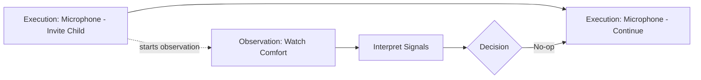
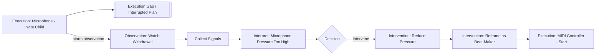

# Dual Process Model: Execution Layer and Observation Layer

## Purpose

This document describes a way to model processes where the main flow of activity is not fully captured by direct node-to-node transitions. It is especially useful when decisions are made generatively based on context, judgment, or a broader rule set.

The core idea is that there are two related process layers:

1. **Execution Layer** — the visible sequence of actions, routines, or activities being performed.
2. **Observation Layer** — the monitoring and decision-making layer that watches the execution layer and decides whether to allow it to continue or intervene.

Both layers can be modeled as processes. They may share similar properties: nodes, edges, start conditions, completion conditions, state, history, and outcomes. Their relationship is the unique part.

---

## Core Duality

The execution layer represents what is currently being done.

The observation layer represents what is being noticed, interpreted, and decided while execution is happening.

```text
Execution Layer:
[Execution Process A]     [Execution Process B]     [Execution Process C]

Observation Layer:
        observe → interpret → decide → no-op or intervene
```

The execution layer may look like a horizontal array of disconnected executions. Each execution can itself contain many nodes.

The observation layer provides continuity across those executions. It watches the execution layer and can decide whether to let the current process continue or redirect to another process.

---

## The Two Layers

### 1. Execution Layer

The execution layer contains concrete routines, actions, or procedures.

Examples in a kids DJ birthday context:

- Kid arrival routine
- Microphone engagement routine
- MIDI controller routine
- Dance game routine
- Birthday shoutout routine
- Parent interaction routine
- Cool-down routine

An execution process has nodes such as:

```text
Microphone Routine:
[start]
→ [offer microphone]
→ [demo call-and-response]
→ [invite child]
→ [child responds]
→ [celebrate]
→ [end]
```

This layer captures the **planned or actual activity path**.

---

### 2. Observation Layer

The observation layer contains monitoring, interpretation, and decision processes.

Examples:

- Observe comfort
- Observe engagement
- Observe confidence
- Observe crowd energy
- Observe parent expectations
- Observe sensory overload
- Observe whether a child is withdrawing
- Decide whether to continue, soften, redirect, or intervene

An observation process also has nodes:

```text
Microphone Withdrawal Observation:
[start observation]
→ [collect signals]
→ [interpret signals]
→ [assess confidence]
→ [choose decision]
→ [complete observation]
```

The observation layer is usually active while execution is happening. It does not replace execution. It monitors execution.

---

## Shared Process Properties

Both execution processes and observation processes can be modeled with similar properties.

| Property | Execution Layer | Observation Layer |
|---|---|---|
| Nodes | Concrete actions or activity steps | Sensing, interpreting, deciding steps |
| Edges | Planned procedural flow | Reasoning or assessment flow |
| Start | Activity begins | Observation is triggered or becomes available |
| Completion | Routine ends, pauses, or is interrupted | Decision is produced |
| State | Current action, participant, context | Current signals, confidence, interpretation |
| Output | Performed activity | No-op or intervention decision |
| History | What actually happened | Why continuation or intervention happened |

The difference is not that one is a process and the other is not. Both are processes. The difference is their **role** and their **interaction**.

---

## Layer Interaction

The observation layer is linked to the execution layer in two important places:

1. The **start edge** of an observation process is linked to an execution process node.
2. The **completion edge** of an observation process connects back to an execution process node.

That means an observation does not float independently. It is anchored to execution.

```text
Execution Layer:
[Microphone: invite child]
        │
        │ starts observation
        ▼
Observation Layer:
[observe withdrawal]
→ [interpret comfort]
→ [decide]
        │
        ├── no-op ────────► [Microphone: continue]
        │
        └── intervene ───► [MIDI Controller: invite child]
```

Even when the observation produces a no-op, the observation still completes and connects to an execution node. That execution node may simply be the next node in the same process, or an explicit `end observation / continue execution` marker.

---

## Two Decision Outcomes

The observation layer generally produces one of two high-level outcomes.

### Outcome 1: No-op

A no-op means the observer noticed the situation, evaluated it, and decided not to intervene.

The current execution process continues.

```text
Execution Layer:
[offer microphone]
→ [demo call-and-response]
→ [invite child]
→ [child responds]
→ [celebrate]
→ [end]

Observation Layer:
[start observing at invite child]
→ [signals are acceptable]
→ [confidence is sufficient]
→ [decision: no-op]
→ [connect to microphone continue]
```

In the execution history, this may not appear as a visible break. The observer process still occurred, but it did not alter the main execution path.

---

### Outcome 2: Intervention

An intervention means the observer detected a meaningful condition and decided the current execution should be changed, interrupted, softened, or redirected.

```text
Execution Layer:
[Microphone Routine]
[start]
→ [offer microphone]
→ [invite child]
→ [withdrawal detected]

Observation Layer:
[start observing at invite child]
→ [collect withdrawal signals]
→ [infer microphone pressure is too high]
→ [decision: intervene]
→ [select lower-pressure activity]

Execution Layer:
[MIDI Controller Routine]
[start]
→ [reframe child as beat-maker]
→ [demo simple button]
→ [invite child to press]
→ [celebrate first interaction]
```

In the execution history, this intervention may appear as a gap or discontinuity. That gap is not an error. It is explained by the observation layer.

---

## Execution History Semantics

The execution history records what actually happened, not only what was planned.

### No-op history

```text
Microphone Routine:
[start] → [offer] → [demo] → [invite] → [respond] → [celebrate] → [end]
```

The observation occurred, but it did not create a visible discontinuity.

### Intervention history

```text
Microphone Routine:                         MIDI Controller Routine:
[start] → [offer] → [invite]        ||      [reframe] → [demo] → [invite] → [celebrate]
```

The `||` represents a visible execution discontinuity.

The observation layer explains that discontinuity:

```text
Observation Process:
[started from Microphone: invite]
→ [detected withdrawal]
→ [interpreted high pressure]
→ [decided intervention]
→ [connected to MIDI Controller: reframe]
```

---

## Important Modeling Principle

Do not force every possible transition into direct execution edges.

Instead of this:

```text
Microphone Routine → MIDI Controller Routine
```

Model this:

```text
Microphone Routine Node
→ Observation Process
→ Decision
→ Target Execution Node
```

This keeps the execution layer cleaner and allows the observation layer to apply broader, generative rules.

The microphone routine does not need to know every possible future routine. The observation layer decides whether a transition is needed based on context.

---

## Observation Process Lifecycle

An observation process can be modeled with the following lifecycle.

```text
1. Anchor to execution node
2. Start observation
3. Collect signals
4. Interpret signals
5. Evaluate against policy or rules
6. Decide no-op or intervention
7. Connect completion to an execution node
8. Record observation history
```

### Example

```text
Anchor:
Execution node = Microphone Routine / Invite Child

Observation:
Watch for withdrawal from microphone activity

Signals:
- Child steps back
- Child looks away
- Child holds microphone away from mouth
- Child freezes
- Child gives tiny responses
- Child looks to parent for help
- Child moves toward another object

Interpretation:
The microphone may be creating too much social pressure.

Decision:
Intervene.

Completion Edge:
Connect to MIDI Controller Routine / Reframe Child as Beat-Maker.
```

---

## Intervention as Its Own Process

An intervention does not have to be a single edge. It can also be an execution process.

```text
Intervention Process:
[start]
→ [reduce pressure]
→ [avoid making the child feel they failed]
→ [reframe the role]
→ [offer a lower-pressure option]
→ [transition to target routine]
→ [end]
```

For example:

```text
Microphone-to-MIDI Intervention:
[start]
→ [smile and remove pressure]
→ [say: "Awesome, let’s try being the beat-maker now"]
→ [show one MIDI button]
→ [invite one simple press]
→ [celebrate the sound]
→ [start MIDI Controller Routine]
```

This means a redirect is not just a jump. It is a managed transition.

---

## Suggested Visual Model

Use three lanes:

```text
LANE 1 — Execution History
[Microphone Routine]        || gap ||        [MIDI Controller Routine]

LANE 2 — Observation / Policy Layer
observe comfort → detect withdrawal → decide intervention → select lower-pressure activity

LANE 3 — Intervention Execution
soften pressure → reframe role → invite MIDI controller → hand control to child
```

For no-op:

```text
LANE 1 — Execution History
[Microphone Routine continues normally]

LANE 2 — Observation / Policy Layer
observe comfort → no intervention → connect to next microphone node

LANE 3 — Intervention Execution
none
```

---

## Mermaid Diagram: No-op



---

## Mermaid Diagram: Intervention



---

## Generic Data Model

A generic schema could look like this:

```yaml
execution_process:
  id: microphone_routine
  type: execution
  nodes:
    - id: mic_start
      label: Start microphone routine
    - id: mic_invite_child
      label: Invite child to use microphone
    - id: mic_continue
      label: Continue microphone engagement
    - id: mic_end
      label: End microphone routine

observation_process:
  id: observe_microphone_withdrawal
  type: observation
  anchored_to:
    execution_process_id: microphone_routine
    execution_node_id: mic_invite_child
  nodes:
    - id: obs_start
      label: Start observing withdrawal
    - id: collect_signals
      label: Collect behavioral signals
    - id: interpret_signals
      label: Interpret comfort and engagement
    - id: decide
      label: Decide no-op or intervention
  outcomes:
    - id: no_op
      connects_to:
        execution_process_id: microphone_routine
        execution_node_id: mic_continue
    - id: intervene
      connects_to:
        execution_process_id: midi_controller_routine
        execution_node_id: midi_start
```

---

## Decision Policy Example

```yaml
policy:
  id: reduce_public_performance_pressure
  applies_when:
    - current_activity_requires_public_performance
    - child_shows_withdrawal_signals
  preferred_decision:
    type: intervention
  intervention_goal:
    - reduce social pressure
    - preserve child confidence
    - offer agency
    - move to lower-pressure interaction
  possible_targets:
    - midi_controller_routine
    - sound_effect_button_routine
    - group_dance_game
    - parent_supported_interaction
```

---

## Kids DJ Example

### Starting execution

```text
Kid arrives
→ Check available instrument
→ Microphone is available
→ Start microphone engagement routine
```

### Observer starts from execution node

```text
Execution Node:
Microphone Routine / Invite Child

Observation Process:
Watch for microphone withdrawal
```

### Observer evaluates

```text
Signals:
- Child steps back
- Child avoids eye contact
- Child does not speak into the microphone
- Child looks uncomfortable

Interpretation:
The microphone may feel too public or high-pressure.
```

### Decision: intervention

```text
Decision:
Intervene and redirect to a lower-pressure instrument.

Target execution node:
MIDI Controller Routine / Start Beat-Maker Role
```

### Transition script

```text
"Awesome, let’s try being the beat-maker now. You don’t even have to sing — just press one of these and you control the music."
```

### New execution

```text
MIDI Controller Routine:
[start]
→ [show one simple button]
→ [invite one press]
→ [play sound]
→ [celebrate]
→ [build pattern]
```

---

## Summary

The model is not a single process graph. It is a layered process system.

```text
Execution layer:
What is happening.

Observation layer:
What is being monitored and interpreted.

Decision layer:
Whether to continue or intervene.

Intervention layer:
How a redirect is executed when needed.
```

The observation layer creates continuity between execution processes that may look disconnected at the execution level. A no-op keeps the execution history visually continuous. An intervention creates a visible discontinuity or gap, and the observation process explains why that gap occurred and how the next execution node was selected.
